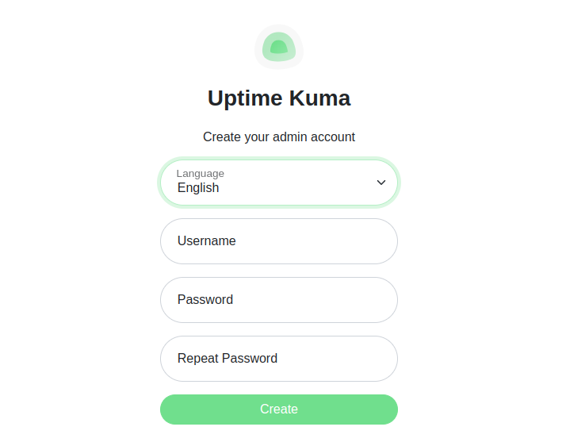

[[uptime-kuma-helm-chart]]
= Uptime Kuma Helm Chart

image:https://github.com/k3rnelpan1c-dev/uptime-kuma-helm/actions/workflows/container-build.yaml/badge.svg[🏗️ Container Image Build, link="https://github.com/k3rnelpan1c-dev/uptime-kuma-helm/actions/workflows/container-build.yaml"]
image:https://img.shields.io/maintenance/yes/2025[Maintenance]
image:https://img.shields.io/github/license/k3rnelpan1c-dev/uptime-kuma-helm[GitHub]

This repo contains the automation to repackage link:https://github.com/louislam/uptime-kuma[uptime-kuma] into a non-root OCI container image as well as a simple Helm 3 Chart to deploy on OpenShift, but also on Kubernetes.

The Helm Chart will deploy a single Pod as part of a `StatefulSet`, you can configure persistence and optionally deploy a OpenShift `Route` or regular K8s `Ingress` alongside.

== Custom Image

The custom image within this repo is built with the intent to repackage _uptime-kuma_ in an OpenShift compatible way (i.e. to support and work properly with arbitrary UIDs), therefor the image is also a non-root image.
It is used within this chat and its sources can be fund under the `container` folder within this repo or here:

[source,dockerfile]
----
include::./container/Containerfile[]
----

I published a prebuilt version of this to link:https://quay.io/repository/k3rnel-pan1c/uptime-kuma?tab=info[Quay.io] and reference that within the Chart, feel free to use that or build it yourself :wink:.

Alternatively, the image is also pushed to link:https://github.com/k3rnelpan1c-dev/uptime-kuma-helm/pkgs/container/uptime-kuma[ghcr.io] (GitHub Container registry) so there is a backup mirror when you run into issues with Quay.

== Support

IMPORTANT: Please note that this is plainly an *UNOFFICIAL* way to install _uptime-kuma_. So please do not expect to get help and or support in the official _uptime-kuma_ issues or other forms of help sections!

This Helm Chart and the image where validated against Open Shift 4.x, yet they should work fine with regular Kubernetes.

I will try to keep this Chart and container image updated and operational, yet it may take me a moment to get to the latest _uptime-kuma_ release (~1-2 days usually).

== Dry-run helm Chart

----
$ kubectl create namespace uptime-kuma
$ helm install --dry-run --namespace uptime-kuma uptime-kuma  ./uptime-kuma
NAME: uptime-kuma
LAST DEPLOYED: Wed Feb 22 10:49:44 2023
NAMESPACE: uptime-kuma
STATUS: pending-install
REVISION: 1
HOOKS:
---
# Source: uptime-kuma/templates/tests/test-connection.yaml
apiVersion: v1
kind: Pod
metadata:
  name: "uptime-kuma-test-connection"
  namespace: uptime-kuma
  labels:
    helm.sh/chart: uptime-kuma-1.0.3
    app.kubernetes.io/name: uptime-kuma
    app.kubernetes.io/instance: uptime-kuma
    app.kubernetes.io/version: "1.20.1"
    app.kubernetes.io/managed-by: Helm
  annotations:
    "helm.sh/hook": test
spec:
  containers:
    - name: wget
      image: docker.io/busybox
      command: ["/bin/sh"]
      args: ['uptime-kuma:80']
      args: ["-c", "cd tmp/ ; wget 'uptime-kuma:80'"]
  restartPolicy: Never
MANIFEST:
---
# Source: uptime-kuma/templates/serviceaccount.yaml
apiVersion: v1
kind: ServiceAccount
metadata:
  name: uptime-kuma
  namespace: uptime-kuma
  labels:
    helm.sh/chart: uptime-kuma-1.0.3
    app.kubernetes.io/name: uptime-kuma
    app.kubernetes.io/instance: uptime-kuma
    app.kubernetes.io/version: "1.20.1"
    app.kubernetes.io/managed-by: Helm
---
# Source: uptime-kuma/templates/ghcr-secret.yaml
# kubectl create secret docker-registry dockerconfigjson-github-com --docker-server=ghcr.io  --docker-username=gdha --docker-password=$(cat ~/.ghcr-token) --dry-run=client -oyaml >ghcr-secret.yaml
# Edit ghcr-secret.yaml and add namespace: celsius in the metadata section.
apiVersion: v1
data:
  .dockerconfigjson: eyJhdXRocyI6eyJnaGNyLmlvIjp7InVzZXJuYW1lIjoiZ2RoYSIsInBhc3N3b3JkIjoiZ2hwX3V5TzRJcFJyek5qRXNuSU5zdzRENXVWUVVnZGFaUjQ0djRjNiIsImF1dGgiOiJaMlJvWVRwbmFIQmZkWGxQTkVsd1VuSjZUbXBGYzI1SlRuTjNORVExZFZaUlZXZGtZVnBTTkRSMk5HTTIifX19
kind: Secret
metadata:
  creationTimestamp: null
  name: dockerconfigjson-github-com
  namespace: uptime-kuma
  labels:
    helm.sh/chart: uptime-kuma-1.0.3
    app.kubernetes.io/name: uptime-kuma
    app.kubernetes.io/instance: uptime-kuma
    app.kubernetes.io/version: "1.20.1"
    app.kubernetes.io/managed-by: Helm
type: kubernetes.io/dockerconfigjson
---
# Source: uptime-kuma/templates/secrets.yaml
apiVersion: v1
kind: Secret
metadata:
  name: uptime-kuma
  namespace: uptime-kuma
  labels:
    helm.sh/chart: uptime-kuma-1.0.3
    app.kubernetes.io/name: uptime-kuma
    app.kubernetes.io/instance: uptime-kuma
    app.kubernetes.io/version: "1.20.1"
    app.kubernetes.io/managed-by: Helm
type: Opaque
---
# Source: uptime-kuma/templates/service.yaml
apiVersion: v1
kind: Service
metadata:
  name: uptime-kuma
  namespace: uptime-kuma
  labels:
    helm.sh/chart: uptime-kuma-1.0.3
    app.kubernetes.io/name: uptime-kuma
    app.kubernetes.io/instance: uptime-kuma
    app.kubernetes.io/version: "1.20.1"
    app.kubernetes.io/managed-by: Helm
spec:
  type: LoadBalancer
  externalTrafficPolicy: Local
  ports:
    - port: 80
      targetPort: http
      protocol: TCP
      name: http
  selector:
    app.kubernetes.io/name: uptime-kuma
    app.kubernetes.io/instance: uptime-kuma
---
# Source: uptime-kuma/templates/statefulSet.yaml
apiVersion: apps/v1
kind: StatefulSet
metadata:
  name: uptime-kuma
  namespace: uptime-kuma
  labels:
    helm.sh/chart: uptime-kuma-1.0.3
    app.kubernetes.io/name: uptime-kuma
    app.kubernetes.io/instance: uptime-kuma
    app.kubernetes.io/version: "1.20.1"
    app.kubernetes.io/managed-by: Helm
  annotations:
spec:
  replicas: 1
  serviceName: uptime-kuma
  selector:
    matchLabels:
      app.kubernetes.io/name: uptime-kuma
      app.kubernetes.io/instance: uptime-kuma
  template:
    metadata:
      labels:
        app.kubernetes.io/name: uptime-kuma
        app.kubernetes.io/instance: uptime-kuma
    spec:
      imagePullSecrets:
        - name: dockerconfigjson-github-com
      serviceAccountName: uptime-kuma
      securityContext:
        {}
      containers:
        - name: uptime-kuma
          securityContext:
            {}
          image: "ghcr.io/gdha/pi4-uptime-kuma:v1.0"
          imagePullPolicy: IfNotPresent
          env:
            - name: UPTIME_KUMA_PORT
              value: '3001'
            - name: PORT
              value: '3001'
          ports:
            - name: http
              containerPort: 3001
              protocol: TCP
          volumeMounts:
            - name: uptime-storage
              mountPath: /app/data
          livenessProbe:
            exec:
              command:
              - extra/healthcheck
          readinessProbe:
            httpGet:
              path: /
              port: http
              scheme: HTTP
          resources:
            {}
      volumes:
        - name: uptime-storage
          emptyDir:
            sizeLimit: 4Gi

NOTES:
1. Get the application URL by running these commands:
     NOTE: It may take a few minutes for the LoadBalancer IP to be available.
           You can watch the status of by running 'kubectl get --namespace uptime-kuma svc -w uptime-kuma'
  export SERVICE_IP=$(kubectl get svc --namespace uptime-kuma uptime-kuma --template "{{ range (index .status.loadBalancer.ingress 0) }}{{.}}{{ end }}")
  echo http://$SERVICE_IP:80
----

== Installing via helm

----
$ helm install  --namespace uptime-kuma uptime-kuma  ./uptime-kuma
NAME: uptime-kuma
LAST DEPLOYED: Wed Feb 22 11:28:00 2023
NAMESPACE: uptime-kuma
STATUS: deployed
REVISION: 1
NOTES:
1. Get the application URL by running these commands:
     NOTE: It may take a few minutes for the LoadBalancer IP to be available.
           You can watch the status of by running 'kubectl get --namespace uptime-kuma svc -w uptime-kuma'
  export SERVICE_IP=$(kubectl get svc --namespace uptime-kuma uptime-kuma --template "{{ range (index .status.loadBalancer.ingress 0) }}{{.}}{{ end }}")
  echo http://$SERVICE_IP:80
----

To get the external IP address do the following:

----
$ kubectl get svc --namespace uptime-kuma uptime-kuma --template "{{ range (index .status.loadBalancer.ingress 0) }}{{.}}{{ end }}"
192.168.0.234
----

Let do a quick test on the command line:

----
$ export SERVICE_IP=$(kubectl get svc --namespace uptime-kuma uptime-kuma --template "{{ range (index .status.loadBalancer.ingress 0) }}{{.}}{{ end }}")
$ echo http://$SERVICE_IP:80
http://192.168.0.234:80
$ curl http://192.168.0.234:80
Found. Redirecting to /dashboard
----

Allright, open a browser with the http://192.168.0.234:80 URL, and we get to see the initial uptime-kuma screen requesting for a admin account name with password of your choice:

